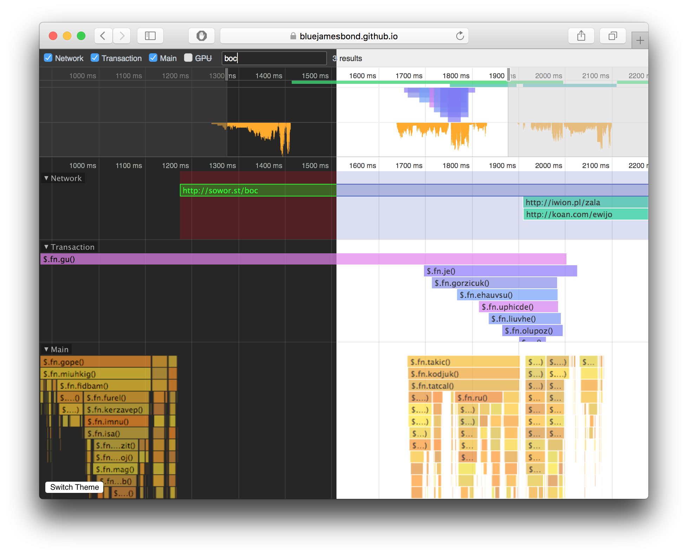

# FlameChart.js
A flamechart component (based on Chrome DevTools). Can be used as a React component or used as a standalone library.



## Features
- Built on React
- Scroll with mouse wheel
- Move with mouse drag
- Customize hover tooltips
- Controlled height + width
- Resizable panes (split panes)
- Listen to event/timing clicks
- Downgrades quality automatically to ensure performance
- Add themes easily with `styles` prop
    - Two built-in themes currently (`Light` and `Dark` like DevTools)
- Filter/search entries

## Demo
View the demo [here](https://bluejamesbond.github.io/FlameChart.js/)

## Example
Offers a standalone and React based mode (NOTE: Documentation is a WIP).

### Standalone

#### Import SimpleFlameChart.js script
Download and import [SimpleFlameChart.js](dist/SimpleFlameChart.js)
```html
<script type='text/javascript' src='SimpleFlameChart.js'></script>
```

#### Render
```js
let { Green } = window.HSLColorGenerator;

let timings = [
    { name: '//google.com', start: 0, end: 200, type: 'request' },
    { name: '//github.com', start: 10, end: 190, type: 'request' },
    { name: '//reddit.com', start: 20, end: 170, type: 'request' }
];

let element = document.getElementById('flamechart');

let simpleFlameChart = window.renderSimpleFlameChart({
  timings: timings,
  theme: 'light',
  start: 0,
  stacks: [
    {
      name: 'Network',
      types: ['request'],
      defaultHeight: 1, // 1 means "100%"
      getTimingColor(timing) {
        return Green.colorForID(timing.name)
      }
    }
  ]
}, element);

// SimpleFlameChart#setTimingSelected(timing, selected)
// SimpleFlameChart#isTimingSelected(timing)
// window#unrenderSimpleFlameChart(element)
 ```

### React Usage (Simple)
SimpleFlameChart enables searching and stack toggling

```jsx
import { SimpleStack, SimpleFlameChart } from 'react-flamechart';
import { Green } rom 'react-flamechart/libs/helpers/HSLColorGenerator'

class Test {
    timings = [
        { name: '//google.com', start: 0, end: 200, type: 'request', highlighted: true },
        { name: '//github.com', start: 10, end: 190, type: 'request' },
        { name: '//reddit.com', start: 20, end: 170, type: 'request' },
        { name: 'Microprocessing', start: 20, end: 170, type: 'gpu' }
    ]

    _getTimingColor(timing) {
        return Green.colorForID(timing.name)
    }

    render() {
        const { timings, state } = this;

        return (
            <SimpleFlameChart start={0}
                              theme={'dark'}
                              timings={timings}>
              <SimpleStack name='Network'
                           types={['request']}
                           defaultHeight={0.8}
                           getTimingColor={::this._getTimingColor} />
              <SimpleStack name='GPU'
                           types={['gpu']}
                           defaultHeight={0.2}
                           getTimingColor={::this._getTimingColor} />
            </SimpleFlameChart>
        );
    }
}
```

### React Usage (Advanced)
Using the base FlameChart React components offers the most customization.

```jsx
import { Dark, FlameChart, Stack } from 'react-flamechart';

class Test {
    timings = [
        { name: '//google.com', start: 0, end: 200, type: 'request', highlighted: true },
        { name: '//github.com', start: 10, end: 190, type: 'request' },
        { name: '//reddit.com', start: 20, end: 170, type: 'request' }
    ]

    state = { width: 500, height: 500 };

    _entryStartGetter = ({end}) => end;
    _entryEndGetter = ({start}) => start;
    _entryNameGetter = ({name}) => name;
    _entryHighlightedGetter = ({highlighted}) => highlighted;
    _entryFillGetter = ({name}, type) => Warm.colorForID(name);

    render() {
        const { timings, state } = this;
        const { width, height } = state;

        return (
            <FlameChart min={0}
                        max={200}
                        start={0}
                        styles={Dark}
                        width={width}
                        height={height}>
              <Stack name='Network'
                     overviewHeight={40}
                     defaultHeight={1} // 1 = "100%"
                     timings={timings}
                     entryStartGetter={::this._entryStartGetter}
                     entryEndGetter={::this._entryEndGetter}
                     entryNameGetter={::this._entryStartGetter}
                     entryHighlightedGetter={::this._entryHighlightedGetter}
                     entryFillGetter={::this._entryFillGetter} />
            </FlameChart>
        );
    }
}
```

## TODO
- Improve Calculator.js
    - Add props attribute to contain all properties
- Ensure heights <= 1